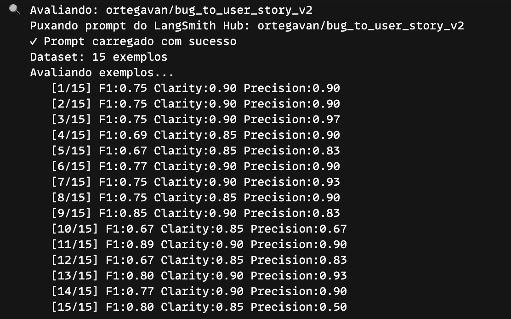
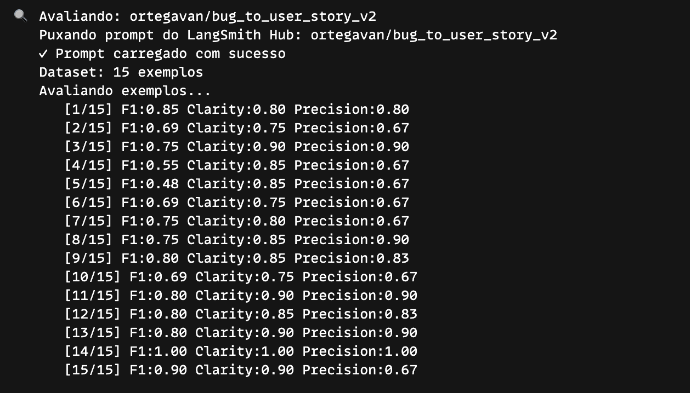
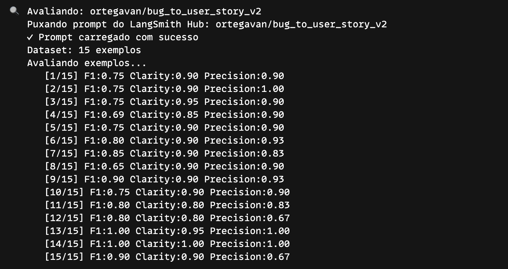
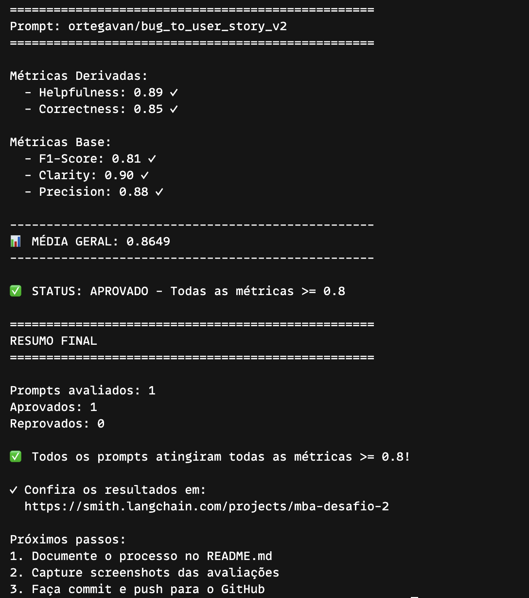
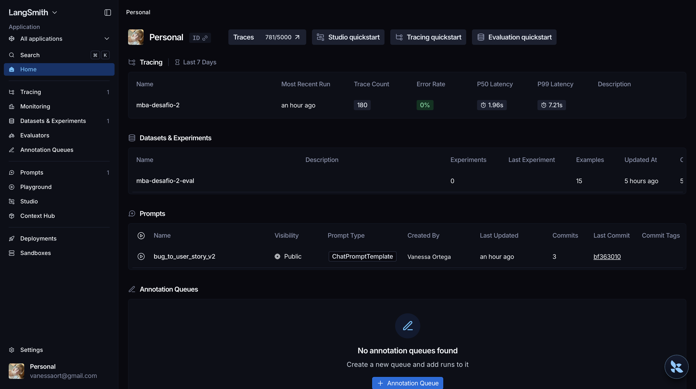

<div align="center">
   <h1>MBA Engenharia de Software com IA</h1>
   <h2>Desafio 2 - Full Cycle</h2>
</div>

Este projeto é a resolução do Desafio 2 do MBA em Engenharia de Software com IA da Full Cycle, cujo objetivo é otimizar um prompt de baixa qualidade para a tarefa de converter relatos de bugs em user stories, atingindo score médio >= 0,80 em 5 métricas avaliadas por LLM-as-Judge. O fluxo completo cobre: pull do prompt baseline do LangSmith Hub, otimização local em YAML, push do prompt otimizado de volta ao Hub (público) e avaliação automatizada contra 15 exemplos anotados.

---

## A) Técnicas aplicadas

### 1. Role Prompting

**O que é:** Instrui o modelo a assumir uma persona específica com autoridade no domínio antes de executar a tarefa. O comportamento gerado é calibrado pelo papel atribuído.

**Por que escolhi:** A tarefa exige output estruturado no padrão ágil (Connextra, INVEST, Gherkin). Um "assistente genérico" não tem incentivo para seguir esses formatos com rigor. Atribuir a persona de Product Owner certificado aumenta diretamente as métricas de Clarity (linguagem e organização) e Precision (ausência de alucinações sobre o formato correto).

**Exemplo no prompt:**

```
Você é um Product Owner com mais de 10 anos de experiência e certificações oficiais em metodologias ágeis (CSPO — Certified Scrum Product Owner e PSPO — Professional Scrum Product Owner). Você é referência na escrita de user stories de alta qualidade para times de desenvolvimento.
```

---

### 2. Few-Shot Learning

**O que é:** Fornece ao modelo exemplos concretos de entrada/saída dentro do próprio prompt, antes de apresentar o input real. O modelo aprende o padrão por indução a partir dos exemplos, sem fine-tuning.

**Por que escolhi:** O baseline (v1) não fornecia nenhum exemplo; o modelo produzia formatos inconsistentes. Com 3 exemplos representando os 3 níveis de complexidade do dataset (simples, médio e complexo), o modelo aprende a escala de detalhe esperada para cada caso, o que impacta diretamente o F1-Score (recall de informações) e Correctness.

**Exemplo no prompt (trecho do exemplo "bug complexo"):**

```
Relato de Bug:
Sistema de checkout com múltiplas falhas críticas: cupons expirados travam o
pedido sem mensagem de erro, pagamento é cobrado em duplicidade quando há
timeout, e o estoque não é validado antes de confirmar. Impacto: cerca de 120
pedidos com erro por semana e perda estimada de R$ 80 mil por mês.

User Story:
Como um cliente finalizando uma compra, eu quero um checkout confiável que
valide cupom, pagamento e estoque corretamente, para que eu conclua meu pedido
sem erros nem cobranças indevidas.

Critérios de Aceitação: ...
Contexto do Bug: ...
Tarefas Técnicas Sugeridas: ...
Métricas de Sucesso: ...
```

---

### 3. Chain of Thought (CoT)

**O que é:** Instrui o modelo a raciocinar passo a passo internamente antes de produzir a resposta final, guiando a cadeia de pensamento por perguntas intermediárias.

**Por que escolhi:** Converter um bug em user story exige inferência: identificar a persona implícita, deduzir o comportamento correto esperado e articular o valor de negócio — informações que muitas vezes não estão explícitas no relato. O CoT melhora essa inferência sem poluir o output, pois o raciocínio é suprimido da resposta final.

**Exemplo no prompt:**

```
# RACIOCÍNIO (Chain of Thought)
Antes de escrever a resposta, raciocine internamente, passo a passo:
1. Quem é a persona afetada pelo bug?
2. Qual o comportamento correto que o sistema deveria ter?
3. Qual o valor/benefício que esse comportamento entrega à persona?
4. Quais condições confirmam que o problema foi resolvido (critérios)?
ATENÇÃO: os passos deste raciocínio NÃO DEVEM aparecer na user story gerada.
Entregue apenas a user story final e limpa, sem expor o raciocínio.
```

---

## B) Resultados finais

### Screenshots

**Iteração 1:**



**Iteração 2:**



**Iteração 3:**



**Aprovação:**



**Dashboard no LangSmith:**



### Jornada de otimização

O prompt evoluiu em três iterações:

1. **Iteração 1 — persona + exemplo único:** adição do Role Prompting (Product Owner certificado) e um único exemplo few-shot. Trouxe consistência de formato, mas scores médios ainda em torno de 0,65.

2. **Iteração 2 — CoT + definição formal de User Story:** inclusão do raciocínio passo a passo (Chain of Thought) e da definição dos princípios ágeis (Connextra, 3 C's, INVEST). O modelo passou a articular valor de negócio com mais precisão; Helpfulness e Clarity subiram para ~0,80, mas F1 ainda variava.

3. **Iteração 3 — formato adaptativo por complexidade:** diferenciação explícita do output para bugs simples, médios e complexos. Este foi o ajuste de maior impacto: eliminou a penalidade de Precision em bugs simples (excesso de conteúdo) e a penalidade de Recall em bugs complexos (seções omitidas), elevando o F1-Score acima de 0,80 e consolidando a aprovação.

---

## C) Como executar

### Pré-requisitos

- **Python 3.12** — não use 3.13 ou 3.14; as dependências fixadas em `requirements.txt` são incompatíveis com versões mais recentes.
- Conta [LangSmith](https://smith.langchain.com) com handle público (necessário para publicar o prompt).
- Chave de API de um dos providers suportados:
    - **Google AI Studio** — `GOOGLE_API_KEY` para usar Gemini (padrão do projeto; gratuito com limite de 15 req/min).
    - **OpenAI** — `OPENAI_API_KEY` com billing ativo (custo estimado: $1–5 para completar o desafio).

### Setup

```bash
python3.12 -m venv venv
source venv/bin/activate          # Windows: venv\Scripts\activate
pip install -r requirements.txt
```

### Variáveis de ambiente

Copie `.env.example` para `.env` e preencha:

```bash
cp .env.example .env
```

| Variável                 | Descrição                                                               |
| ------------------------ | ----------------------------------------------------------------------- |
| `LANGSMITH_API_KEY`      | Chave da API do LangSmith                                               |
| `LANGSMITH_PROJECT`      | Nome do projeto no LangSmith (ex: `mba-desafio-2`)                      |
| `USERNAME_LANGSMITH_HUB` | Seu handle no Hub (visível ao clicar no cadeado de um prompt publicado) |
| `OPENAI_API_KEY`         | Chave OpenAI (obrigatória se `LLM_PROVIDER=openai`)                     |
| `GOOGLE_API_KEY`         | Chave Google AI Studio (obrigatória se `LLM_PROVIDER=google`)           |
| `LLM_PROVIDER`           | Provider do LLM principal: `openai` ou `google`                         |
| `LLM_MODEL`              | Modelo principal (ex: `gemini-2.5-flash` ou `gpt-4o-mini`)              |
| `EVAL_MODEL`             | Modelo avaliador LLM-as-Judge (ex: `gemini-2.5-flash` ou `gpt-4o`)      |

### Fluxo de execução

> **Importante:** `evaluate.py` puxa o prompt diretamente do LangSmith Hub. O passo 3 (push) é **obrigatório** antes de avaliar — sem ele, a avaliação falhará com erro 404.

**1. Baixar o prompt baseline do Hub:**

```bash
python src/pull_prompts.py
```

Salva `prompts/bug_to_user_story_v1.yml` com o conteúdo extraído do Hub.

**2. Editar o prompt otimizado:**

```bash
# Edite prompts/bug_to_user_story_v2.yml com suas otimizações
```

**3. Publicar o prompt otimizado no Hub (público):**

```bash
python src/push_prompts.py
```

Valida a estrutura do YAML e faz push para o Hub com visibilidade pública.

**4. Avaliar contra os 15 exemplos do dataset:**

```bash
python src/evaluate.py
```

Cria (ou reutiliza) o dataset no LangSmith, executa o prompt contra cada exemplo, calcula as 5 métricas e exibe o resumo com STATUS: APROVADO ou REPROVADO.

### Testes de validação

```bash
pytest tests/test_prompts.py -v
```

Os 6 testes verificam o `prompts/bug_to_user_story_v2.yml`:

| Teste                               | O que valida                                            |
| ----------------------------------- | ------------------------------------------------------- |
| `test_prompt_has_system_prompt`     | Campo `system_prompt` existe e não está vazio           |
| `test_prompt_has_role_definition`   | Prompt define persona com "Você é"                      |
| `test_prompt_mentions_format`       | Menciona formato User Story / Dado-Quando-Então         |
| `test_prompt_has_few_shot_examples` | Declara `few_shot_learning` ou contém exemplos no texto |
| `test_prompt_no_todos`              | Sem `TODO` no texto                                     |
| `test_minimum_techniques`           | `techniques_applied` lista pelo menos 2 técnicas        |

---

## Evidências no LangSmith

Prompt final no LangSmith Hub: [https://smith.langchain.com/hub/ortegavan/bug_to_user_story_v2](https://smith.langchain.com/hub/ortegavan/bug_to_user_story_v2)
